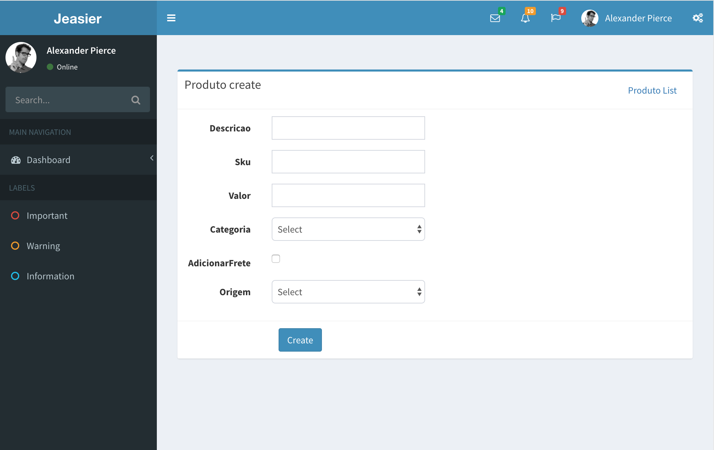

<h1>Jeasier - Java complete crud generator<h1/>

<h2>1.Introdução<h2/>
<h5>Trata-se de uma biblioteca para o ecossistema spring, para projetos spring mvc ou spring boot, na sua primeira versão podemos gerar automaticamente uma aplicação crud com controllers, services, repositories, paginação e views com thymeleaf gerados baseado na sua camada de modelo. Se seu projeto for novo a biblioteca implementa dois templates free : <a>AdminLte</a> e Gentelella.</h5>

<h2>2.Configuração<h2/>
<h5>Para iniciar basta instalar o jar no classpath da aplicação.
O default da biblioteca é a propriedade ‘autoConfiguration = true’, significa que a aplicação irá criar todos os pacotes no nível anterior ao seu modelo para classes, </h5>
<h5>Exemplo : </h5>
<h5> com.jeasier.model >> a aplicação irá criar os demais pacotes a partir de com.jeasier</h5>
<h5>Default para resources</h5>
<ul>
<li>staticos : src/main/resources/static</li>
<li>templates : src/main/resources/templates</li>
</ul>
<h5>Caso seu projeto tenha uma estrutura diferente basta acessar o arquivo easyjava.properties e alterar as seguintes variaveis : <h5>
<ul>
<li>autoConfiguration=false</li>
<li>resourcePath=o caminho dos resources</li>
<li>staticPath=o caminho para statics</li>
<li>templatePath=o caminho para templates</li>
<li>referencePackage=seu pacote de referencia</li>
</ul>

<h2>3. Execução</h2>
<h3>3.1 Para projetos com layouts existentes</h3>
<h4>3.1.1 Geração de crud a partir de uma classe</h4>
<ul>
<li>JeasyAplication app = new JeasyAplication();</li>
<li>app.generateCrud(SuaClasse.class,"seu layout decorator");</li>
</ul>
<h4>3.1.2 Geração de crud a partir de uma pacote</h4>
<ul>
<li>JeasyAplication app = new JeasyAplication();
</li>
<li>app.generateCrud("seu pacote","seu layout decorator");</li>
</ul>

<h3>3.2 Para projetos com novos : </h3>
<h4>3.2.1 Geração de crud a partir de uma classe</h4>
<ul>
<li>JeasyAplication app = new JeasyAplication();</li>
<li>app.generateCrud(SuaClasse.class,new Gentelella());</li>
</ul>
<h4>3.2.1 Geração de crud a partir de uma pacote :</h4>
<ul>
<li>JeasyAplication app = new JeasyAplication();</li>
<li>app.generateCrud("seu pacote",new Gentelella());</li>
</ul>

<h2>4. Customização </h2>
<h5>Para customizar os pacotes, mensagens, path de criação, e mensagens basta alterar o arquivo easyjava.properties.</h5>

<h2>5. Acesso</h2>
<ul>
<li>/entidadeLowerCase/new - criação</li>
<li>/entidadeLowerCase/list – listagem</li>
</ul>
